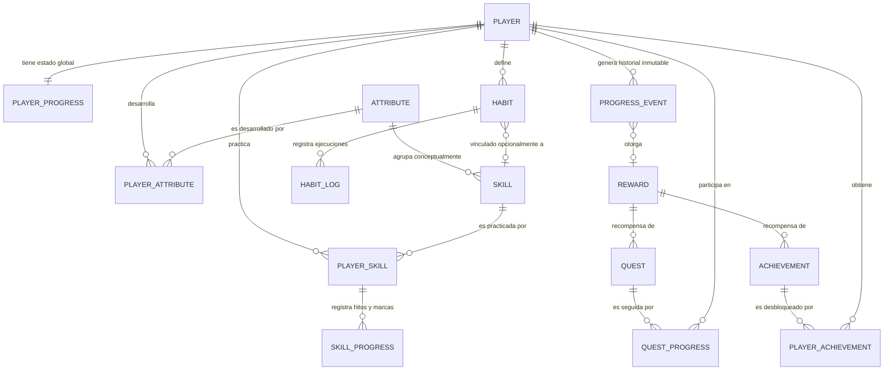

# Chapter One - Modelo de Dominio (Domain Model v0.1)

Este documento define el **Modelo de Dominio conceptual** para el sistema RPG de **Chapter One**, sirviendo como puente técnico entre las reglas del juego descritas en [docs/game-design.md](game-design.md) y la futura implementación en PostgreSQL y Fastify.

> [!IMPORTANT]
> **Fase de Diseño Conceptual**:  
> Este documento no contiene sentencias SQL DDL ni código de producción. Define entidades, atributos lógicos, cardinalidades, reglas de inmutabilidad y decisiones de modelado que gobernarán la base de datos y la capa de servicios.

---

## 1. Diagrama Conceptual de Entidades



---

## 2. Catálogo de Entidades y Responsabilidades

| Entidad | Capa | Responsabilidad Principal | Naturaleza |
| :--- | :--- | :--- | :--- |
| **`Player`** | Identidad | Representa al usuario. Almacena identidad y preferencias base sin estado de juego. | Mutable (Perfil) |
| **`PlayerProgress`** | Progresión | Estado agregado actual del jugador (Total XP, Nivel, Skill Points disponibles). | Mutable (Agregado) |
| **`Attribute`** | Catálogo | Definición de las 7 capacidades generales (Power, Vitality, Endurance, etc.). | Inmutable (Config) |
| **`PlayerAttribute`** | Progresión | Puntuación y rango actual del jugador en cada atributo general. | Mutable (Calculado) |
| **`Skill`** | Catálogo | Definición de capacidades específicas (Bench Press, Running, English, etc.). | Inmutable (Config) |
| **`PlayerSkill`** | Progresión | Relación jugador-habilidad: XP histórico, nivel, proficiency actual y fechas. | Mutable (Progresión) |
| **`SkillProgress`** | Historial | Récords personales (*PRs*), máximos históricos y marcas cuantitativas de una habilidad. | Inmutable (Append-only) |
| **`Habit`** | Comportamiento | Definición y configuración de hábitos repetibles (frecuencia, objetivo, dificultad). | Mutable (Config) |
| **`HabitLog`** | Comportamiento | Registro de ejecución diaria de un hábito (cumplido, omitido, descanso programado). | Inmutable (Auditoría) |
| **`Quest`** | Comportamiento | Plantillas de misiones (diarias, semanales, épicas) con metas y recompensas. | Inmutable (Catálogo) |
| **`QuestProgress`** | Comportamiento | Seguimiento del avance individual de un jugador en una misión activa. | Mutable (Ciclo de vida) |
| **`Achievement`** | Catálogo | Catálogo de logros permanentes e hitos destacados del sistema. | Inmutable (Config) |
| **`PlayerAchievement`**| Progresión | Registro inmutable de logros desbloqueados por el jugador con su fecha y evento. | Inmutable (Append-only) |
| **`Reward`** | Progresión | Estructura polimórfica de recompensas (XP, Skill Points, títulos, cosméticos). | Inmutable (Catálogo) |
| **`ProgressEvent`** | Auditoría | Libro contable inmutable (*Event Ledger*) de todos los cambios de progreso del jugador. | Inmutable (Append-only) |

---

## 3. Especificación Detallada de Entidades

### 3.1. `Player`
* **Propósito**: Representar al usuario en el sistema, desacoplado de la lógica de juego.
* **Atributos conceptuales**:
  * `id`: Identificador único universal (UUID).
  * `auth_user_id`: Referencia al sistema de autenticación externo o cuenta.
  * `username`: Nombre de usuario único para la plataforma.
  * `display_name`: Nombre público o alias dentro del RPG.
  * `timezone`: Zona horaria del jugador (indispensable para evaluar días calendario en hábitos y resets diarios).
  * `created_at`, `updated_at`: Marcas de auditoría.
* **Reglas**: No almacena campos de nivel, XP ni puntuaciones numéricas directamente para evitar desnormalización corruptible.

### 3.2. `PlayerProgress`
* **Propósito**: Vista materializada del estado agregado de progresión del jugador.
* **Atributos conceptuales**:
  * `player_id`: Clave primaria y foránea 1:1 hacia `Player`.
  * `total_xp`: Total acumulado histórico de puntos de experiencia (estrictamente incremental).
  * `current_level`: Nivel derivado del `total_xp`.
  * `unspent_skill_points`: Puntos de habilidad disponibles para gastar.
  * `total_skill_points_earned`: Total histórico de puntos de habilidad obtenidos.
  * `last_level_up_at`: Marca temporal de la última subida de nivel.
  * `updated_at`: Última actualización de estado.
* **Reglas**: Puede reconstruirse o auditarse mediante la agregación de `ProgressEvent`.

### 3.3. `Attribute`
* **Propósito**: Catálogo maestro de capacidades generales.
* **Atributos conceptuales**:
  * `id`: Identificador (ej. `ATTR_POWER`, `ATTR_DISCIPLINE`).
  * `name`: Nombre (Power, Vitality, Endurance, Agility, Mobility, Knowledge, Discipline).
  * `description`: Explicación conceptual del atributo.
  * `icon_key`: Identificador de icono para frontend.
  * `category`: Físico, Mental o Comportamental.

### 3.4. `PlayerAttribute`
* **Propósito**: Estado de madurez del jugador en un atributo determinado.
* **Atributos conceptuales**:
  * `id`: Identificador único.
  * `player_id`: Foránea a `Player`.
  * `attribute_id`: Foránea a `Attribute`.
  * `current_score`: Puntuación actual del atributo (calculada mediante modelo híbrido).
  * `historical_peak_score`: Puntuación máxima alcanzada históricamente.
  * `last_calculated_at`: Fecha del último cálculo/sincronización.
* **Restricción única**: `(player_id, attribute_id)`.

### 3.5. `Skill`
* **Propósito**: Catálogo de habilidades específicas practicables y entrenables.
* **Atributos conceptuales**:
  * `id`: Identificador (ej. `SKILL_BENCH_PRESS`, `SKILL_RUNNING`, `SKILL_PROGRAMMING`).
  * `primary_attribute_id`: Atributo principal con el que se vincula (ej. Power).
  * `secondary_attribute_id`: Atributo secundario opcional.
  * `parent_skill_id`: Habilidad padre opcional (habilita jerarquías y futuros árboles de habilidades).
  * `name`: Nombre descriptivo.
  * `domain`: Dominio formativo (`FITNESS`, `HEALTH`, `LEARNING`, `HOBBIES`, `PRODUCTIVITY`, `PERSONAL_DEV`).
  * `base_decay_rate`: Factor de velocidad de desentrenamiento (`NONE`, `LOW`, `MEDIUM`, `HIGH`).
  * `is_active`: Disponibilidad en catálogo.

### 3.6. `PlayerSkill`
* **Propósito**: Vínculo entre el jugador y una habilidad específica que practica.
* **Atributos conceptuales**:
  * `id`: Identificador único.
  * `player_id`: Foránea a `Player`.
  * `skill_id`: Foránea a `Skill`.
  * `historical_xp`: Experiencia histórica acumulada en la habilidad (**nunca disminuye**).
  * `current_proficiency`: Competencia o forma física actual (0 a 100, **sujeta a Skill Decay**).
  * `historical_max_proficiency`: Techo máximo de competencia alcanzado por el usuario.
  * `skill_level`: Nivel alcanzado dentro de la especialidad.
  * `last_practiced_at`: Fecha y hora de la última sesión realizada.
  * `decay_status`: Estado actual frente a inactividad (`ACTIVE`, `DECAY_LIGHT`, `DECAY_MODERATE`, `DECAY_MAJOR`).
* **Restricción única**: `(player_id, skill_id)`.

### 3.7. `SkillProgress`
* **Propósito**: Registro histórico de hitos cuantitativos y marcas personales (*PRs*).
* **Atributos conceptuales**:
  * `id`: Identificador único.
  * `player_skill_id`: Foránea a `PlayerSkill`.
  * `metric_type`: Tipo de métrica (ej. `MAX_WEIGHT_KG`, `DISTANCE_METERS`, `DURATION_SECONDS`, `REPETITIONS`).
  * `metric_value`: Valor numérico registrado.
  * `is_personal_record`: Indicador booleano de si constituyó un nuevo récord.
  * `achieved_at`: Fecha de consecución.
  * `source_event_id`: Foránea a `ProgressEvent`.
* **Reglas**: Inmutable (append-only). Permite graficar el historial de fuerza y progreso a lo largo de los años.

### 3.8. `Habit`
* **Propósito**: Definición y configuración de una conducta repetible.
* **Atributos conceptuales**:
  * `id`: Identificador único.
  * `player_id`: Foránea a `Player`.
  * `linked_skill_id`: Habilidad asociada opcional (ej. hábito "Correr 30m" $\rightarrow$ Skill "Running").
  * `title`: Título del hábito.
  * `frequency_type`: Tipo de recurrencia (`DAILY`, `DAYS_PER_WEEK`, `SPECIFIC_DAYS`).
  * `target_frequency_value`: Valor de meta (ej. 3 veces por semana).
  * `target_unit`: Unidad de medida (`BOOLEAN_COMPLETION`, `MINUTES`, `LITERS`, `PAGES`, etc.).
  * `difficulty_tier`: Dificultad asignada (`TRIVIAL`, `EASY`, `MEDIUM`, `HARD`).
  * `base_xp_reward`: Puntos de XP base otorgados al cumplirlo.
  * `is_active`: Estado activo/archivado.
  * `created_at`, `archived_at`.

### 3.9. `HabitLog`
* **Propósito**: Registro de ejecución diaria de un hábito por el usuario.
* **Atributos conceptuales**:
  * `id`: Identificador único.
  * `habit_id`: Foránea a `Habit`.
  * `player_id`: Foránea a `Player`.
  * `log_date`: Fecha calendario local del jugador (`YYYY-MM-DD`).
  * `status`: Estado del registro (`COMPLETED`, `SKIPPED`, `REST_DAY`, `FAILED`).
  * `actual_value`: Valor numérico completado (ej. 45 min, 2.5 litros).
  * `validation_status`: Nivel de verificación (`SELF_REPORTED`, `DEVICE_VERIFIED`, `COACH_VERIFIED`).
  * `xp_awarded`: XP otorgado efectivamente por este registro.
  * `progress_event_id`: Foránea a `ProgressEvent` (si generó progreso).
  * `created_at`: Marca temporal de inserción.
* **Restricción única**: `(habit_id, log_date)`. Un solo log formal por hábito y por día.

### 3.10. `Quest`
* **Propósito**: Plantilla maestra de objetivos y desafíos con narrativa.
* **Atributos conceptuales**:
  * `id`: Identificador único.
  * `quest_type`: Tipo de misión (`DAILY`, `WEEKLY`, `EPIC_LONG_TERM`).
  * `title`: Título visible.
  * `description`: Instrucciones de cumplimiento.
  * `required_domain`: Dominio vinculado opcional.
  * `completion_criteria`: Estructura JSON con las condiciones lógicas de victoria (ej. `{"type": "WORKOUT_COUNT", "target": 3}`).
  * `reward_id`: Foránea a `Reward`.
  * `is_active`: Disponibilidad de la quest en el sistema.

### 3.11. `QuestProgress`
* **Propósito**: Instancia individual de una Quest asignada a un Player.
* **Atributos conceptuales**:
  * `id`: Identificador único.
  * `player_id`: Foránea a `Player`.
  * `quest_id`: Foránea a `Quest`.
  * `status`: Estado (`IN_PROGRESS`, `COMPLETED`, `CLAIMED`, `EXPIRED`).
  * `current_progress_value`: Avance actual acumulado hacia la meta.
  * `target_progress_value`: Valor requerido para completar.
  * `started_at`: Fecha de inicio o asignación.
  * `expires_at`: Fecha límite de vencimiento (nula en Quests Épicas).
  * `completed_at`: Fecha de finalización.
  * `claimed_at`: Fecha en que el usuario cobró las recompensas.

### 3.12. `Achievement`
* **Propósito**: Definición de hitos notables y permanentes de la plataforma.
* **Atributos conceptuales**:
  * `id`: Identificador único (ej. `ACH_FIRST_STEP`, `ACH_COMMITTED_30`).
  * `code`: Clave técnica unívoca.
  * `title`: Título conmemorativo.
  * `description`: Requisito para desbloquear.
  * `category`: Categoría (`CONSISTENCY`, `MASTERY`, `RESILIENCE`, `MILESTONE`).
  * `unlock_condition`: Regla lógica de evaluación.
  * `reward_id`: Foránea a `Reward`.

### 3.13. `PlayerAchievement`
* **Propósito**: Registro de logro obtenido por un jugador.
* **Atributos conceptuales**:
  * `id`: Identificador único.
  * `player_id`: Foránea a `Player`.
  * `achievement_id`: Foránea a `Achievement`.
  * `unlocked_at`: Fecha y hora exacta de desbloqueo.
  * `trigger_event_id`: Foránea a `ProgressEvent` que disparó el logro.
* **Restricción única**: `(player_id, achievement_id)`. Los logros solo se obtienen una vez.

### 3.14. `Reward`
* **Propósito**: Estructura unificada y extensible de compensaciones del juego.
* **Atributos conceptuales**:
  * `id`: Identificador único.
  * `reward_type`: Tipo de recompensa (`XP`, `SKILL_POINTS`, `TITLE`, `BADGE`, `UNLOCK`, `COSMETIC`).
  * `payload`: Estructura JSON con los parámetros específicos (ej. `{"xp": 300}`, `{"skill_points": 1}`, `{"title_id": "TIT_FORGED_STEEL"}`).
  * `description`: Texto explicativo amigable para el jugador.

### 3.15. `ProgressEvent` (Ledger de Auditoría)
* **Propósito**: Registro inmutable de cada hecho significativo que altera la progresión del usuario.
* **Atributos conceptuales**:
  * `id`: Identificador único (UUID o Snowflake ordenable cronológicamente).
  * `player_id`: Foránea a `Player`.
  * `event_type`: Tipo de evento (`WORKOUT_COMPLETED`, `HABIT_COMPLETED`, `QUEST_COMPLETED`, `ACHIEVEMENT_UNLOCKED`, `SKILL_XP_GAINED`, `LEVEL_UP`, `PERSONAL_RECORD`, `REST_DAY_LOGGED`, `SKILL_DECAY_CALCULATED`).
  * `source_entity_type`: Tipo de tabla origen (`HabitLog`, `QuestProgress`, `WorkoutSession`, etc.).
  * `source_entity_id`: Identificador UUID de la entidad origen.
  * `xp_delta`: Cantidad de XP generada por este evento (0 si no aplica).
  * `skill_points_delta`: Puntos de habilidad otorgados (0 si no aplica).
  * `metadata`: Estructura JSON con contexto forense (valores previos, valores resultantes, multiplicadores de Recovery Bonus aplicados, etc.).
  * `occurred_at`: Marca temporal exacta del suceso.
* **Reglas**: Estrictamente **Append-Only**. Ninguna fila de esta tabla puede ser actualizada ni eliminada.

---

## 4. Matriz de Relaciones y Cardinalidades

| Entidad Origen | Cardinalidad | Entidad Destino | Descripción de la Relación |
| :--- | :---: | :--- | :--- |
| `Player` | `1 : 1` | `PlayerProgress` | Cada jugador tiene un único registro de progreso agregado. |
| `Player` | `1 : N` | `PlayerAttribute` | Un jugador posee un estado por cada atributo del sistema. |
| `Attribute` | `1 : N` | `PlayerAttribute` | Un atributo es desarrollado por múltiples jugadores. |
| `Attribute` | `1 : N` | `Skill` | Un atributo agrupa múltiples habilidades hijas. |
| `Player` | `1 : N` | `PlayerSkill` | Un jugador practica múltiples habilidades. |
| `Skill` | `1 : N` | `PlayerSkill` | Una habilidad es practicada por múltiples jugadores. |
| `PlayerSkill`| `1 : N` | `SkillProgress` | Una habilidad de jugador acumula múltiples marcas o PRs históricos. |
| `Skill` | `0..1 : N`| `Skill` | Habilidades jerárquicas (árboles de habilidades). |
| `Player` | `1 : N` | `Habit` | Un jugador define múltiples hábitos personales. |
| `Habit` | `1 : N` | `HabitLog` | Un hábito acumula un historial diario de registros de ejecución. |
| `Habit` | `N : 0..1`| `Skill` | Un hábito puede vincularse opcionalmente a una habilidad específica. |
| `Player` | `1 : N` | `QuestProgress` | Un jugador participa en múltiples instancias de misiones. |
| `Quest` | `1 : N` | `QuestProgress` | Una misión es seguida por múltiples jugadores. |
| `Reward` | `1 : N` | `Quest` | Una recompensa puede asignarse a una o más misiones. |
| `Player` | `1 : N` | `PlayerAchievement` | Un jugador desbloquea múltiples logros. |
| `Achievement`| `1 : N` | `PlayerAchievement` | Un logro es obtenido por múltiples jugadores. |
| `Reward` | `1 : N` | `Achievement` | Un logro puede conceder una recompensa configurada. |
| `Player` | `1 : N` | `ProgressEvent` | Un jugador acumula un flujo inmutable de eventos de progreso. |
| `ProgressEvent`| `N : 0..1`| `Reward` | Un evento puede estar vinculado a una recompensa adjudicada. |

---

## 5. Inmutabilidad vs. Estado Mutable

El modelo garantiza una separación estricta entre la **fuente de verdad histórica** y el **estado mutable de conveniencia**:

```text
┌────────────────────────────────────────────────────────┐
│             ESTADO INMUTABLE (Append-Only)             │
│  - Total XP histórico acumulado                        │
│  - Eventos de progreso (ProgressEvent)                 │
│  - Registros diarios de hábitos (HabitLog)             │
│  - Hitos cuantitativos y récords (SkillProgress)       │
│  - Logros desbloqueados (PlayerAchievement)            │
│                                                        │
│  * Garantía: Permite auditar y recalcular el estado    │
│    completo de la cuenta desde el día 1.               │
└──────────────────────────┬─────────────────────────────┘
                           │ alimenta / proyecta
                           ▼
┌────────────────────────────────────────────────────────┐
│                ESTADO MUTABLE (Operativo)              │
│  - Competencia actual de habilidad (CurrentProficiency)│
│  - Estado de inactividad de habilidad (DecayStatus)    │
│  - Métrica móvil de consistencia (Consistency Score)   │
│  - Contador de racha consecutiva (Streak)              │
│  - Progreso de misiones activas (QuestProgress)        │
│  - Hábitos activos/archivados (Habit)                  │
└────────────────────────────────────────────────────────┘
```

---

## 6. Flujo Conceptual del Progreso

```text
[ Acción en el Mundo Real ] (Entrenamiento, beber agua, estudiar)
            │
            ▼
[ Acción Validada ] (Se valida fecha, telemetría o registro manual)
            │
            ▼
[ HabitLog / WorkoutSession ] (Se persiste el hecho concreto)
            │
            ▼
[ ProgressEvent Generado ] (Se emite evento inmutable con xp_delta)
            │
            ├─────────────────────────────────────────┐
            ▼                                         ▼
   [ Actualización Skill ]                  [ Actualización Global ]
   - Suma XP histórico en PlayerSkill       - Suma total_xp en PlayerProgress
   - Recalcula Current Proficiency          - Evalúa Level Up
   - Aplica Recovery Bonus si decayó        - Otorga Skill Points si subió nivel
   - Evalúa Récords (SkillProgress)         - Evalúa Quests y Achievements
            │                                         │
            └────────────────────┬────────────────────┘
                                 ▼
                    [ Actualización Atributos ]
                    - Recalcula PlayerAttribute mediante
                      proyección híbrida de sus skills hijas
```

---

## 7. Decisiones de Arquitectura Recomendadas

### 7.1. Atributos: Enfoque Híbrido (Recomendado)
* **Opciones evaluadas**:
  * *A) Puramente almacenados manualmente*: Rechazada; viola la regla fundamental de que los atributos no se suben con botones.
  * *B) Puramente calculados al vuelo en cada consulta*: Rechazada; penaliza el rendimiento en lectura al consultar el perfil del jugador.
  * *C) Enfoque Híbrido (Recomendada)*: La entidad `PlayerAttribute` almacena el valor materializado actual (`current_score`). Este valor se recalcula automáticamente cuando un `ProgressEvent` modifica una de sus `Skills` asociadas. De este modo, las lecturas son $O(1)$ y la coherencia con las habilidades se mantiene garantizada por el backend.

### 7.2. Skill XP vs. Player XP (Prevención de Doble Conteo)
* **Estrategia Recomendada**:
  * Cada acción genera un único paquete de XP atómico en un `ProgressEvent`.
  * **Ejemplo**: Una sesión de Press de Banca genera `+100 XP`.
  * Ese evento incrementa `PlayerProgress.total_xp` en 100 y `PlayerSkill(Bench Press).historical_xp` en 100.
  * **Regla de integridad**: El XP de la Skill **no es una transferencia secundaria** que luego "suma otra vez" al jugador. Ambos contadores son dos dimensiones del mismo evento primario. No hay duplicación de XP.

### 7.3. Representación de Días de Descanso (Rest Days)
* **Estrategia Recomendada**:
  * En `HabitLog`, el estado `status = 'REST_DAY'` permite al usuario marcar formalmente que su planificación incluía descanso para ese día.
  * El motor de decay evaluará la fecha de la última sesión física efectiva pero contrastará los `REST_DAY` programados para **congelar temporalmente el contador de inactividad** dentro de límites saludables (ej. hasta 2 días de descanso por semana no avanzan la ventana de decay).

### 7.4. Cálculo de Consistencia Móvil (Ventana de 30 Días)
* **Estrategia Recomendada**:
  * No almacenar únicamente un porcentaje estático (ej. `83%`).
  * Almacenar los registros individuales en `HabitLog` indexados por `(player_id, log_date)`.
  * La consulta del Consistency Score para cualquier intervalo se resuelve eficientemente como:
    $$\text{Score} = \frac{\text{COUNT}(\text{status} = \text{'COMPLETED'})}{\text{COUNT}(\text{días con meta en el periodo})} \times 100$$
  * Para acelerar el renderizado móvil, la API puede mantener una vista materializada o caché de los últimos 30 días calculada al cierre del día.

---

## 8. Capacidad de Auditoría del Modelo

El modelo permite responder de forma directa a las preguntas forenses planteadas en el diseño:

1. **¿Cuándo y por qué ganó XP el jugador?**  
   $\rightarrow$ Consultando `ProgressEvent WHERE player_id = X AND xp_delta > 0`, filtrando por `event_type` y examinando `metadata`.
2. **¿Qué actividad concreta originó ese progreso?**  
   $\rightarrow$ Siguiendo las claves foráneas `source_entity_type` y `source_entity_id` en `ProgressEvent`.
3. **¿Cuándo se desbloqueó un Achievement?**  
   $\rightarrow$ En `PlayerAchievement.unlocked_at`, vinculado a su `trigger_event_id`.
4. **¿Cuál fue su récord histórico y cuándo ocurrió?**  
   $\rightarrow$ En `SkillProgress WHERE player_skill_id = Y AND is_personal_record = TRUE`.
5. **¿Cuándo comenzó el decay y cuándo se recuperó?**  
   $\rightarrow$ A través de los eventos `SKILL_DECAY_CALCULATED` y eventos de práctica posterior con multiplicador `recovery_bonus` registrado en `metadata`.

---

## 9. Cuestiones Abiertas y Decisiones que Requieren Aprobación

> [!WARNING]
> Las siguientes decisiones han sido formuladas con una propuesta técnica recomendada, pero requieren confirmación explícita antes de proceder a la creación de tablas o código:

1. **Fórmula de Nivel ($100 \times N^{1.6}$)**:
   * *Propuesta recomendada*: Interpretar la fórmula como el **XP Total Acumulado** necesario para alcanzar el nivel $N$.
   * *Alternativa*: Interpretarla como el XP incremental necesario únicamente para transicionar de $N-1$ a $N$.
   * *Estado*: Pendiente de ratificación.

2. **Proporción de Atribución Multi-Skill**:
   * Cuando un hábito o entrenamiento involucra más de una Skill simultáneamente (ej. Crossfit involucra Running y Squats): ¿el XP del evento se divide proporcionalmente entre las Skills involucradas (50%/50%), o cada Skill recibe el 100% mientras el Player solo recibe los 100 puntos una vez?
   * *Propuesta recomendada*: El evento define un XP total para el Player y cuotas de XP asignadas individualmente a cada Skill hija en el payload de metadata.

3. **Política de Congelamiento de Decay por Rest Days**:
   * ¿Cuál será el límite máximo de `REST_DAY` consecutivos tolerados antes de que el contador de inactividad comience a descontar días para el decay?
   * *Propuesta recomendada*: Un máximo de 3 días de descanso consecutivos o 10 días al mes. Pausas mayores (lesión, vacaciones) deberán modelarse mediante un estado explícito de "Modo Pausa / Vacaciones".

4. **Escala Numérica de los Atributos**:
   * ¿Los atributos se expresarán en una escala cerrada (ej. 1 a 100 o rangos bronce/plata/oro/platino), o serán números abiertos sin límite superior que escalan infinitamente con la experiencia del jugador?
   * *Propuesta recomendada*: Escala de 1 a 100 normalizada mediante funciones logarítmicas de las Skills hijas, con niveles de maestría visuales.
